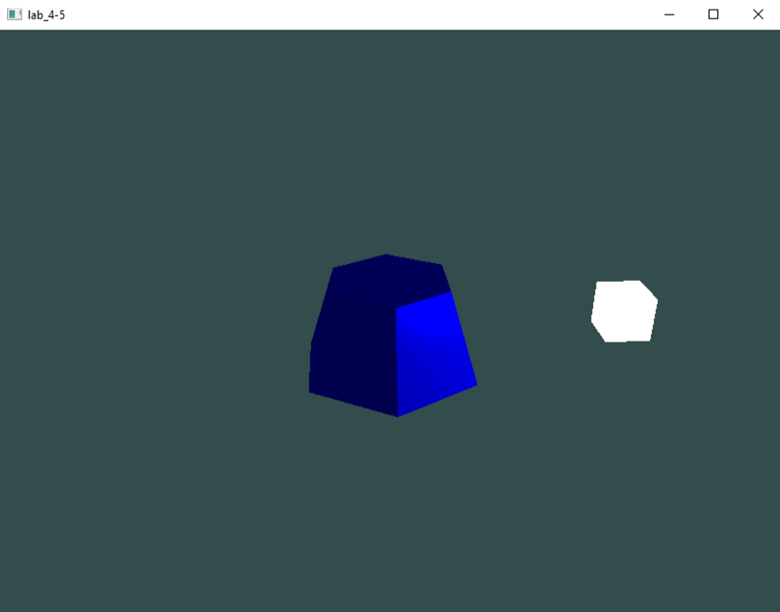
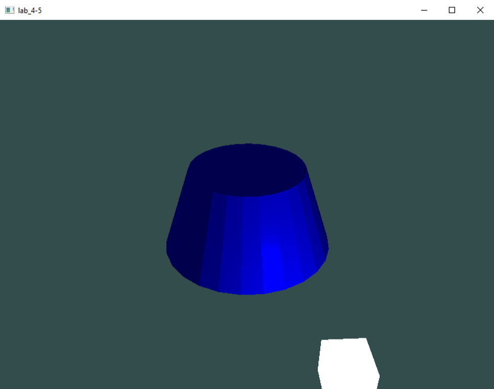

# Задание:
Создать графическое приложение с использованием OpenGL. Использовать буфер вершин. Точность аппроксимации тела задается пользователем. Обеспечить возможность вращения и масштабирования многогранника и удаление невидимых линий и поверхностей. Реализовать простую модель освещения на GLSL. Параметры освещения и отражающие свойства материала задаются пользователем в диалоговом режиме. 
## Вариант: 
Прямой усеченный круговой конус 

